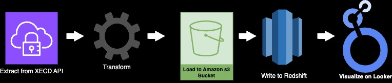
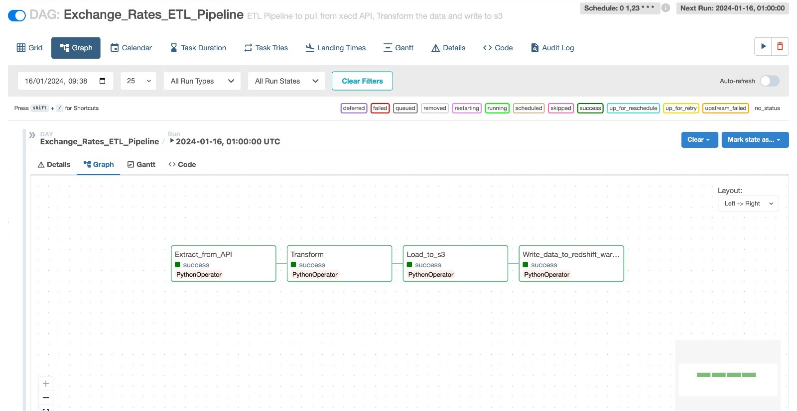

# Autocheck Assessment solutions 1 & 2

### Solution 2

The following ETL architecture was implemented for this architecture  
 . 

##### Brief explanation of how the code works
The Entire is code is run in a docker container to avoid the problem of code working on certain machines and not on others.  

The first step involves pulling data from "xecdapi convert_from" API by creating an account on the [site](https://currencydata.xe.com/account/dashboard) and generating an `Account API ID` and `Account API Key`. This step was implemented in the [Extract layer script](dags/scripts/solution2_extract.py) .  

The [transform layer script](dags/scripts/solution2_transform.py) simply normalizes this data by flattening out the nested json, renaming the columns to more intuitive names and selecting only the relevant fields in the given order   

The [loading script](dags/scripts/solution2_load.py) receives the new data coming from the API and compares it with the existing data in the s3 bucket while checking for duplicates and dropping them accordingly. This script finally writes the de-duplicated data back to the s3 bucket, overwriting whatever data that existing was there. This ensures that same data from same date is not entered repeatedly. 

Finally, a redshift cluster with public access permissions was provisioned and the de-duplicated data from s3 written to it. This is implemented in the [solution2_write_to_data_warehouse script](dags/scripts/solution2_write_to_data_warehouse.py)

A looker studio dashboard with public viewing access was also created. See **[here](https://lookerstudio.google.com/reporting/7ee2e4f2-2b33-4f7d-9425-bf0dda635370)**

### Steps to replicate solution 2
- Ensure you have docker up and running on your machine 
- Ensure you have installed docker compose on your machine. Follow the [link](https://docs.docker.com/compose/install/) to install docker compose for your operating system if you don't have it installed already (Ensure to install with airflow version `airflow:2.8.0`)  
- Clone this repository to your local machine by running the command `git clone https://github.com/Akawi85/autoCheck-assessment.git`
- `cd` into the project directory
- Run the following command in you terminal `docker compose up` and wait until docker finishes downloading the necessary files and setting up the airflow UI 
- Wait until you see the message `Listening at: http://0.0.0.0:8080` as part of the log output on your terminal. This may take some time  
- Follow the link above or copy it and paste in your browser  
- You'll be prompted to enter a username and password on the airflow web browser UI, for these use `airflow` for both username and password fields.  
- The `Exchange_Rates_ETL_Pipeline` DAG is paused by default, unpause the DAG to trigger it  
- The `Exchange_Rates_ETL_Pipeline` DAG has 4 tasks that run in sequence and triggers a bunch of other processes and takes approximately 1 minute to run successfully.  
- On successful completion of the DAG run, you should have a screen similar to  this:

- Make sure to click on the following **[Looker Studio Link](https://lookerstudio.google.com/reporting/7ee2e4f2-2b33-4f7d-9425-bf0dda635370)** to see the data in a looker studio report